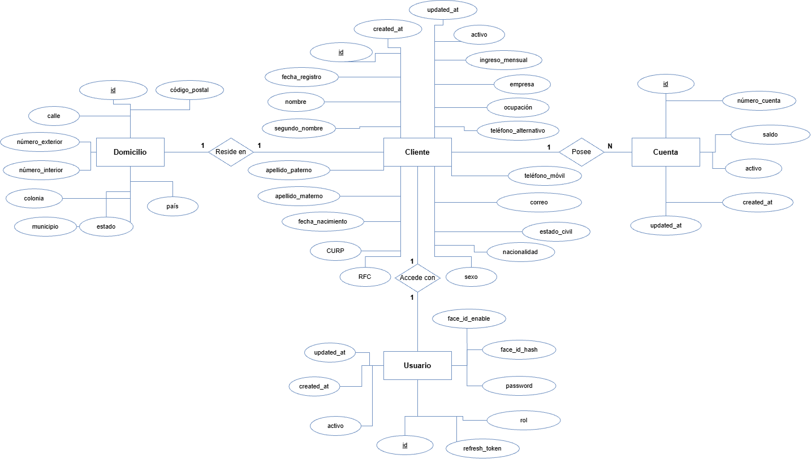

# Proyecto Integrador: Onboarding de Clientes Personas Físicas (Fintech)

## Objetivo del Proyecto
Desarrollar una aplicación robusta en Java (Spring Boot) que permita el proceso completo de **Onboarding de clientes personas físicas** para una institución financiera. El sistema gestiona el registro de clientes, validación estricta de identidad (CURP, RFC, Correo), creación automática de cuentas bancarias asociadas con saldo inicial, y el aprovisionamiento de seguridad mediante la creación de un usuario protegido con autenticación JWT y contraseñas cifradas.

---

## Arquitectura y Patrones de Diseño

El proyecto sigue una arquitectura **Multicapa (N-Tier Architecture)** clásica de Spring Boot para garantizar la separación de responsabilidades (Separation of Concerns), mantenibilidad y escalabilidad.

### Capas Implementadas:
1. **Capa de Controladores (API REST):** Exponen los endpoints protegidos y públicos. Manejan la semántica HTTP y delegan la lógica pura a los servicios.
2. **Capa de Servicios (Business Logic):** Contiene todas las reglas de negocio estrictas (validación de mayoría de edad, colisión de cuentas, generación de cuentas únicas). 
3. **Capa de Acceso a Datos (Repository):** Interfaces JpaRepository que abstraen las consultas SQL.
4. **Capa Transversal de Seguridad:** Filtros interceptores (JWT) y manejo de excepciones globales.

### Patrones de Diseño Aplicados:
*   **DTO (Data Transfer Object):** Desacopla la base de datos de la API. Se evita la exposición de entidades JPA puras (prevención de ataques de Mass Assignment o exposición de passwords).
*   **Facade / Orchestrator:** El OnboardingService actúa como orquestador, manejando la creación en cascada de Cliente -> Domicilio -> Cuenta -> Usuario dentro de una sola transacción ACID (@Transactional).
*   **Global Exception Handling:** Uso de @ControllerAdvice para capturar excepciones como OnboardingException o validaciones de Constraint, devolviendo respuestas JSON estandarizadas en lugar de trazas de error nativas.

---

## Tecnologías y Librerías Utilizadas

1.  **Java 17:** Uso de records, text blocks y características modernas.
2.  **Spring Boot 3.x:** Framework base para el desarrollo rápido y configuración automática (Inyección de dependencias, Servidor Tomcat embebido).
3.  **Spring Security & JWT (JSON Web Tokens):** Para la protección de las rutas. Generación de Access Tokens y Refresh Tokens para mantener sesiones seguras sin estado persistente.
4.  **Spring Data JPA / Hibernate:** ORM para el mapeo objeto-relacional (ORM).
5.  **PostgreSQL / H2 Database:** Motor de base de datos relacional para producción y pruebas respectivamente.
6.  **Lombok:** Reducción drástica de código boilerplate (@Data, @Getter, @Setter, @NoArgsConstructor, @Slf4j).
7.  **BCrypt (JBCrypt / Spring Security Crypto):** Algoritmo de hash de un solo sentido (One-way hashing) con "salting" automático para el almacenamiento seguro de contraseñas.
8.  **MapStruct:** Generación automática de código eficiente para el mapeo entre Entidades (Entities) y DTOs en tiempo de compilación.
9.  **Redis:** Utilizado para la gestión de revocación de sesiones concurrentes y el almacenamiento temporal de Refresh Tokens.
10. **JUnit 5 & Mockito:** Frameworks para garantizar la calidad del código mediante la automatización de Pruebas Unitarias exhaustivas.

---

## Diseño de Base de Datos y Persistencia

Se diseñó el esquema relacional tomando en cuenta las mejores prácticas de normalización, uso eficiente de memoria y protección de la integridad de los datos.

### Diagrama Entidad-Relación (ER)

### Tipos de Datos Utilizados y Justificación (PostgreSQL Best Practices)
El diseño se centró en la optimización del almacenamiento en memoria y disco, evitando tipos genéricos como TEXT cuando no eran estrictamente necesarios:

*   **Llaves Primarias (Primary Keys - PK):** Se utilizó BIGSERIAL (mapeado a BIGINT en Java) estandarizado bajo el nombre id en todas las tablas. 
    *   *Justificación:* El uso de secuencias autoincrementables nativas de 64 bits (BIGINT) garantiza un crecimiento masivo de registros a largo plazo sin el riesgo de desbordamiento (Integer Overflow), además de permitir consultas e indexación ultra rápidas a través de B-Trees.
*   **Llaves Foráneas (Foreign Keys - FK):** Identificadores relacionales como cliente_id utilizan BIGINT con restricciones strictas en la base de datos (CONSTRAINT fk_cliente FOREIGN KEY).
    *   *Justificación:* Garantizan la Integridad Referencial de los datos. Se prohíbe la inserción de cuentas bancarias o domicilios si el ID del cliente no existe físicamente en la tabla maestra, bloqueando los datos huérfanos a nivel infraestructura.
*   **Cadenas Limitadas:**  
    *   CURP: VARCHAR(18) exactos, con constraint de longitud (CHECK length).
    *   RFC: VARCHAR(13) (Permite 12 o 13 según reglas fiscales).
    *   Código Postal: VARCHAR(5) (No numérico porque los CPs pueden iniciar con '0').
    *   Teléfono: VARCHAR(10) (Restringido para no aceptar formatos internacionales complejos sin parseo).
    *   *Justificación:* El uso de VARCHAR(X) en lugar de TEXT protege al sistema de inyección de payloads masivos en memoria.
*   **Datos Monetarios (Saldos / Ingresos):** NUMERIC(15, 2) mapeado a BigDecimal en Java. 
    *   *Justificación:* **NUNCA** usar Float o Double para dinero debido al problema matemático IEEE 754 de pérdida de precisión en punto flotante. NUMERIC garantiza precisión decimal exacta para centavos.
*   **Fechas:** DATE genérico para fecha de nacimiento.
*   **Tiempos de Auditoría:** TIMESTAMP WITH TIME ZONE para created_at y updated_at.
    *   *Justificación:* Es la mejor práctica para evitar discrepancias cuando el servidor, la base de datos y el cliente están en distintas zonas horarias.
*   **Estados Lógicos:** BOOLEAN nativo para campos como ctivo o ace_id_enable. 
    *   *Justificación:* Ocupa menos espacio (1 bit de almacenamiento) y permite la creación de índices parciales muy rápidos (WHERE activo = true).
*   **Seguridad:** El password es VARCHAR(255). 
    *   *Justificación:* Los hashes BCrypt siempre resultan en 60 caracteres, pero se deja margen para migraciones futuras a algoritmos como Argon2id que podrían requerir más longitud.

### Relaciones:
*   **Cliente (1) ↔ (1) Domicilio:** Relación obligatoria mediante llave foránea en Domicilio.
*   **Cliente (1) ↔ (N) Cuentas:** Un cliente físico puede tener múltiples cuentas.
*   **Cliente (1) ↔ (1) Usuario:** Asociación estricta de seguridad. El correo del cliente actúa como el *username* de acceso.

---

## Toma de Decisiones y Flujo de Trabajo Interno

Para asegurar un sistema predecible y seguro, se tomaron decisiones de diseño a nivel arquitectónico y de seguridad:

### 1. Flujo de Transaccionalidad (Onboarding)
El alta de un cliente implica impactar 4 tablas distintas. Se tomó la decisión de envolver el orquestador bajo el contexto @Transactional. Si ocurre un fallo en el último paso (ej. error al hashear el password para la tabla Usuarios), la base de datos realizará un **Rollback automático** revirtiendo la cuenta bancaria y el cliente. Esto previene información "huérfana" o cuentas bancarias de clientes fantasma.

### 2. Validaciones de Negocio Defensivas
*   **Validación de Edad:** Se usa Period.between comparando contra la LocalDate actual.
*   **Unicidad Estricta:** Uso combinado de Constraints a nivel de base de datos (UNIQUE INDEX) para prevención de "Race Conditions" en alta concurrencia, y chequeos lógicos previos (existsByCurp, existsByRfc, existsByCorreo) lanzando excepciones legibles HTTP 409 Conflict.
*   **Generación de Cuentas Colisionables:** El número de cuenta (10 dígitos numéricos aleatorios) se genera dentro de un bucle do-while que consulta la base de datos. Si el azar genera un número de cuenta existente, se vuelve a generar hasta encontrar uno disponible.

### 3. Baja Lógica y Cascadas Seguras
Decidimos **no eliminar físicamente (Hard Delete)** los registros para preservar el historial financiero. Cuando un cliente es dado de baja (ctivo = false):
1. **Cascada de Estado:** Sus cuentas bancarias pasan automáticamente a inactivas.
2. **Desconexión Segura:** Su registro en la tabla Usuarios se marca como inactivo.
3. **Invalidación de JWT en tiempo real:** El JwtAuthenticationFilter en Spring Security consulta explícitamente isEnabled() en cada petición (evaluando el campo ctivo de la DB). Si el usuario acaba de ser inhabilitado, su Token JWT existente (aunque no haya expirado) devolverá un HTTP 403 de forma inmediata bloqueando la sesión.

---

## API REST: Rutas y Permisos

El sistema expone un total de **14 endpoints principales** distribuidos entre Seguridad, Onboarding, Clientes y Cuentas. Se tomó la decisión de restringir los permisos por roles y estado de sesión.

### Endpoints Públicos (No requieren JWT)
Se dejan abiertos estrictamente los necesarios para el alta inicial y la generación del Token.
1. POST /api/v1/auth/login: Autentica al usuario usando Correo + BCrypt Password. Retorna Access & Refresh Tokens.
2. POST /api/v1/auth/refresh: Renueva tokens expirados mediante Redis.
3. POST /api/v1/onboarding: Inicia todo el registro del cliente y crea cuenta/usuario inicial.

### Endpoints Protegidos (Requieren JWT Activo y Rol)
Todas las operaciones subsecuentes requieren el envío del Bearer Token en los headers.

**Módulo Cliente:**
4. GET /api/v1/clientes: Listar todos (Activos e Inactivos).
5. GET /api/v1/clientes/{id}: Consulta por ID.
6. GET /api/v1/clientes/curp/{curp}: Búsqueda exacta por CURP.
7. GET /api/v1/clientes/rfc/{rfc}: Búsqueda exacta por RFC.
8. GET /api/v1/clientes/{id}/cuentas: Obtiene cuentas vinculadas a un ID.
9. PATCH /api/v1/clientes/{id}: Actualización parcial defensiva (no permite modificar CURP, RFC).
10. DELETE /api/v1/clientes/{id}: Baja lógica en cascada (desactiva cliente, cuentas y usuario).

**Módulo Cuenta:**
11. GET /api/v1/cuentas: Lista global.
12. POST /api/v1/cuentas: Permite al usuario logueado aprovisionarse de una cuenta adicional.
13. GET /api/v1/cuentas/{numeroCuenta}: Consulta detalles y saldo de una cuenta **(Solo si la cuenta pertenece al dueño del JWT para evitar filtración de saldos)**.
14. DELETE /api/v1/cuentas/{numeroCuenta}: Baja lógica de una cuenta bancaria.

*Adicionalmente se cuenta con endpoints del módulo de productos externos (GestoPago) para simulaciones de pagos.*

---

## Pruebas Unitarias (Testing)

La calidad del software se garantizó mediante pruebas unitarias exhaustivas aisladas del entorno de base de datos utilizando **JUnit 5** y **Mockito**.

*   **Cobertura:** Se crearon 66 casos de prueba (100% de éxito en la compilación y ejecución).
*   **Estrategia:** Se probaron los controladores inyectando "Mocks" de los servicios reales para asegurar que las respuestas HTTP (200, 201, 404, 409 Conflict, 410 Gone, 403 Forbidden) fueran emitidas bajo las circunstancias correctas.
*   **Servicios y Mappers:** Se probó la lógica central de negocio verificando colisiones, cálculos de fecha de nacimiento, inyección de tokens JWT, encriptación de passwords y conversiones de MapStruct, asegurando que las reglas del negocio no dependan de la infraestructura.

*(La documentación tabulada de pruebas individuales fue almacenada en el archivo CSV Documentacion_Pruebas_Detallada.csv)*

---

## Puesta en Marcha (Ejecución y Pruebas Locales)

### Prerrequisitos
*   Java JDK 17
*   Base de datos PostgreSQL en ejecución localmente (o configuración H2 para testing).
*   Redis (Opcional, configurado en perfil si se requiere persistencia de sesiones complejas).

### Pasos de ejecución
1. **Limpiar y compilar el proyecto:**
   `ash
   ./gradlew clean build -x test
   `
2. **Ejecutar Pruebas Unitarias y Generar Reporte Jacoco:**
   `ash
   ./gradlew test
   `
   *El reporte HTML de pruebas se genera en: uild/reports/tests/test/index.html*
3. **Levantar el Servidor Spring Boot:**
   `ash
   ./gradlew bootRun
   `

El servidor estará expuesto localmente en el puerto 8080.

